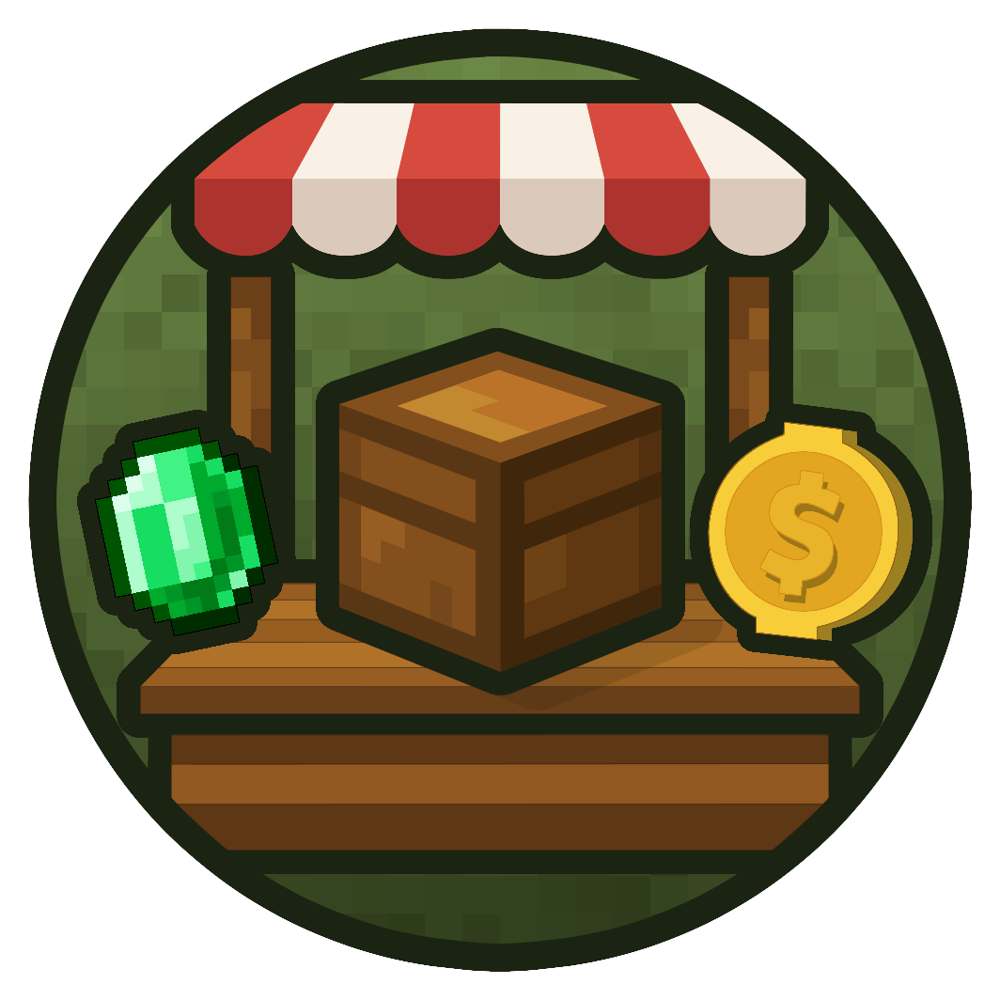
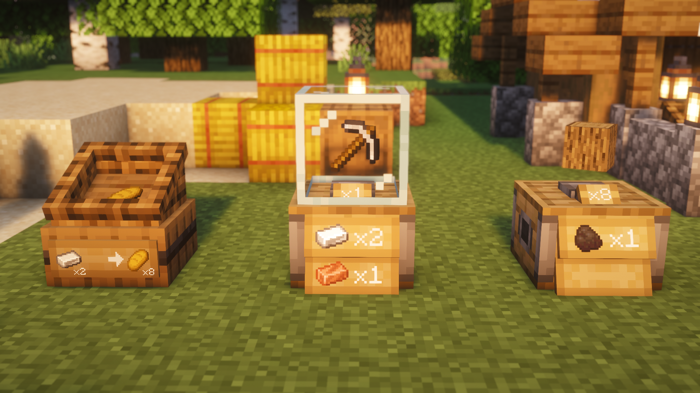
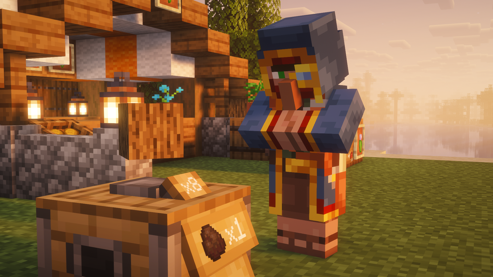
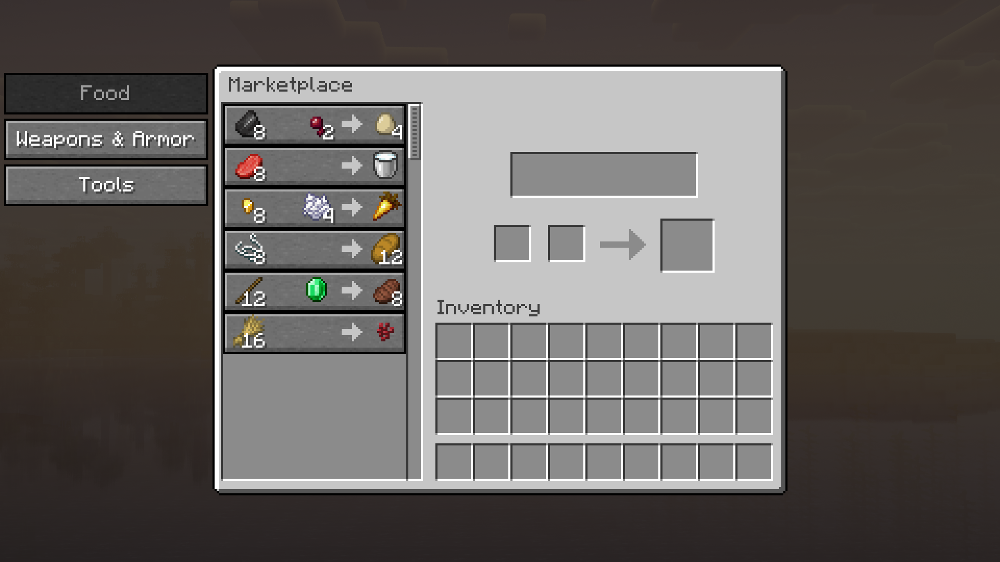

  

# MarketBlocks

**The Complete Economy, Physical Shop & Autonomous Trader NPC Suite for Minecraft**

&nbsp;&nbsp;
&nbsp;&nbsp;
&nbsp;&nbsp;
&nbsp;&nbsp;
&nbsp;&nbsp;

---

**MarketBlocks** delivers a complete, server-authoritative economy framework designed for SMPs, survival servers, and modpacks. It seamlessly bridges physical player commerce, global server trading, and lifelike NPC customers into one unified experience across three core pillars:

---

## **✨ Core Features**

### 🏪 **Physical Player Shops (Trade Stand & Market Crate)**

  

- **Two Unique Block Styles**:
  - **Trade Stand**: Elegant two-block shop counter with an animated glass showcase.
  - **Market Crate**: Rustic single-block crate with **dynamically draining stock rendering** that visually reflects storage fill levels in real-time.
- **Flexible 2-to-1 Pricing**: Accept up to **two distinct payment item stacks** for one result item stack.
- **Visual Customization & Clerk NPCs**:
  - Floating showcase items that spin, bob, and glow with customizable scale and fullbright illumination.
  - Station an ambient **Villager clerk** (15 selectable professions and biomes) or **Player Skin clerk** (by Minecraft username) behind your counter!
- **Customer Access Modes**: Restrict trades to **Everyone**, a specific **Whitelist**, or block troublemakers with a **Blacklist**.
- **Co-Ownership & Security**: Register up to **10 trusted co-owners**. Unbreakable by visitors, immune to explosions, and protected by **Admin Shift-Break** checks.
- **Safe Bulk Buying**: Customers can hold **Shift** while clicking the result item to instantly purchase the maximum affordable quantity without clicking repeatedly.
- **Transaction History**: Detailed in-GUI log records customer names, player heads, timestamps, purchase quantities, and trader ranks.
- **Automation Ready**: Optional hopper, pipe, and chest transfer automation with configurable input/output sides *(Disabled by default; enable via `enableChestExtension = true` in `config/marketblocks/singleoffer/general.toml`)*.

---

### 🚶 **Autonomous Trader NPCs (AI Customers)**

  

- **Lifelike Market Activity**: Wandering traders periodically spawn near active, stocked player shops and explore player shopping districts.
- **Three Distinct Customer Ranks**:
  - **Citizen**: Everyday shoppers with modest budgets.
  - **Wealthy**: High-tier merchants buying in larger volumes (cartographer monocle).
  - **Noble**: Aristocrats with deep pockets looking for luxury items (scholarly glasses & librarian hat).
- **Smart Counter Reach**: NPCs pathfind naturally, stopping 1.5–2.5 blocks in front of counters and interacting over slabs, fences, and tables.
- **Deliberation & Authenticity**: Traders pause to inspect items, shake their heads if overpriced or uninterested, celebrate purchases with happy particles, and carry their bought goods visibly in their arms.
- **Rage Mode Easter Egg**: Provoking or attacking a merchant will prompt humorous and dangerous consequences!

---

### 🌐 **Server Marketplace (Central Economy Hub)**

  

- **Quick Access**: Open instantly via keybind (**`O`**) or command (**`/mb marketplace`**), or right-click linked decorative counters in player hubs.
- **Live In-Game Editor**: Operators can enable Edit Mode (`/mb admin editmode true`) to create categories, add offers, adjust prices, and reorder items directly in the GUI without touching JSON files.
- **Dynamic Demand Curves**: Real-time price scaling automatically raises item prices under heavy buying pressure and cools down over time.
- **Scarcity & Daily Limits**: Set global stock caps or personal daily purchase limits per player with configurable restock timers.
- **Promotional Discounts**: Schedule timed sales events on marketplace offers or admin shops with automatic countdowns.

---

## **🗺️ Integrations & Mod Compatibility**

MarketBlocks integrates smoothly with popular modpack staples out of the box:

- **JourneyMap**: Real-time shop and market stall markers placed directly on your map. Interactive chat search results (`/mb search <item>`) generate instant waypoints!
- **Xaero's Minimap & Worldmap**: Chat search results provide clickable **[Waypoint]** and **[TP]** coordinates for Xaero's map systems.
- **Just Enough Items (JEI)**: Native JEI integration registers shop GUI tabs as *Extra Areas*, preventing JEI item panels from overlapping buttons.
- **Jade & WTHIT**: Looking at any shop block displays live trade icons, prices, owner name, open/closed status, and out-of-stock warnings.
- **FTB Chunks**: Native `ftbchunks:interact_whitelist` tag support allows visitors to trade inside claimed territory without extra configuration.
- **Open Parties and Claims (OpenPAC)**: Compatible via `forcedBlockProtectionExceptionList` in `openpartiesandclaims-server.toml`.

---

## **💻 Quick Commands & Keybinds**

> 💡 **Tip:** Every command starting with `/marketblocks` can also be run using the short **`/mb`** alias!

### Essential Player Commands

| Command | Shorthand | Description |
| --- | --- | --- |
| `/marketblocks marketplace` | `/mb marketplace` | Opens the central Marketplace GUI (Default Keybind: **`O`**). |
| `/marketblocks search <item> [page]` | `/mb search <item>` | Finds player shops and market offers with **[Waypoint]** and **[TP]** buttons. |
| `/marketblocks stats` | `/mb stats` | Displays top 10 SingleOfferShops and top 10 Marketplace offers by sales. |

> 🔑 **Operator / Admin Commands**: Operators have access to extensive management commands (`/mb admin editmode`, `/mb admin marketplace link`, `/mb admin sale`, `/mb admin reload`, etc.). For the complete permission and command reference, visit the **[Commands & Permissions Wiki](https://github.com/BigBull-H3RO/MarketBlocks/wiki/Commands-and-Permissions)**.

---

## **⚙️ Modular Configuration**

All configuration files are organized cleanly in `config/marketblocks/`:

- **`main.toml`**: First-join trade book, non-OP teleport permissions (`allowNonOpTeleport`), map integration toggles.
- **`client.toml`**: Client-side graphics (e.g. `enableShopItemRendering` for low-end hardware FPS boosts).
- **`marketplace.toml`**: Purchase chat confirmations, public broadcasts, and server-wide shared daily limits (`sharedDailyLimits`).
- **`trader/trader.toml`**: Spawning rules, customer visit limits, coin budgets, dynamic market saturation, and Easter egg toggle.
- **`trader/*.json`**: Custom item values (`trader_item_values.json`), purchase blacklists (`trader_blacklist.json`), and custom customer names (`trader_names.json`) — hot-reloadable with `/mb admin reload`!
- **`singleoffer/general.toml`**: Bedrock-grade blast resistance, player shop limits, chest extension toggle (`enableChestExtension`), and GUI tab permissions.
- **`singleoffer/tradestand.toml` & `singleoffer/marketcrate.toml`**: Default visuals, NPC models, and alert thresholds for newly placed shops.

---

## **📚 Comprehensive Documentation**

> 📖 **Need in-depth guides, crafting recipes, permission tables, or setup tutorials?** 
> Explore our full documentation on the **[Official GitHub Wiki](https://github.com/BigBull-H3RO/MarketBlocks/wiki)**.

---

## **⚖️ License**

MarketBlocks utilizes a dual licensing model:

- **Source Code**: The mod source code is licensed under the **MIT License**. See [`LICENSE`](LICENSE).
- **Assets**: All textures, 3D models, and branding assets are **All Rights Reserved** by BigBull-H3RO. See [`LICENSE_ASSETS`](LICENSE_ASSETS).

---

### 💬 Community & Support

**Found a bug or have a suggestion?** 
Open an issue on our [GitHub Issue Tracker](https://github.com/BigBull-H3RO/MarketBlocks/issues)

**Download Releases & Updates** 
[CurseForge](https://www.curseforge.com/minecraft/mc-mods/marketblocks) • [Modrinth](https://modrinth.com/mod/marketblocks)

