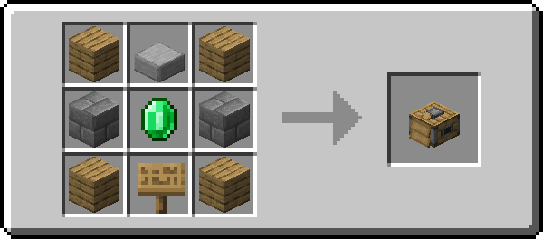
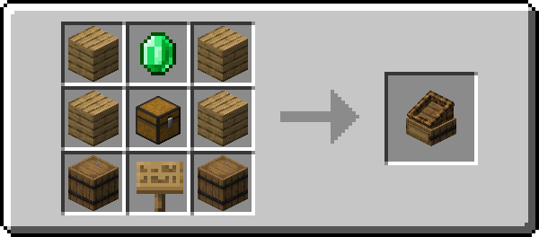
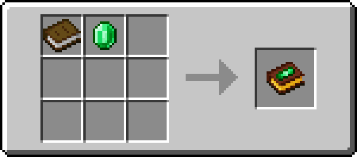
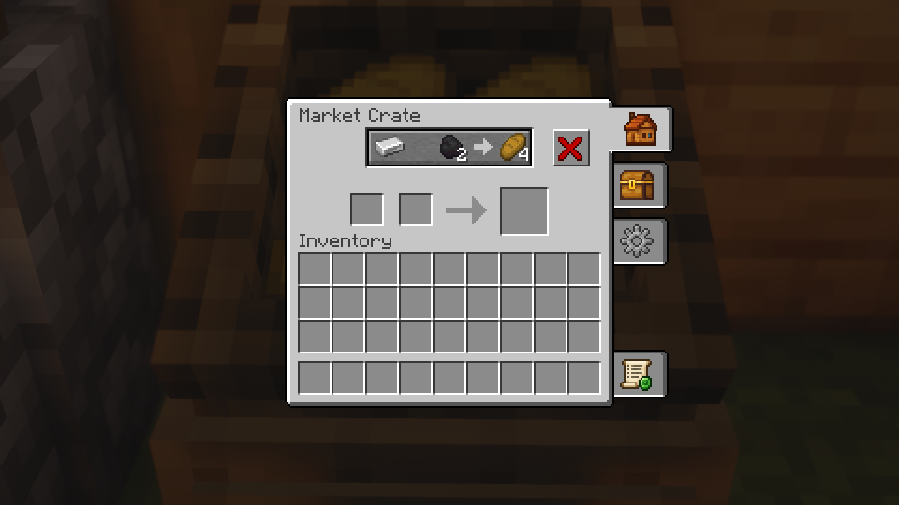
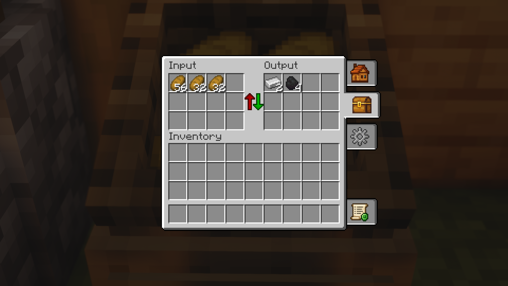
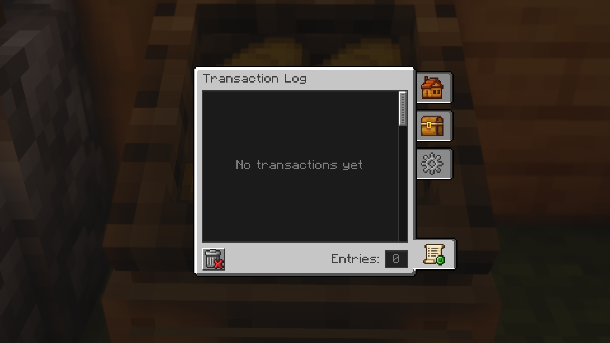

# SingleOfferShop: Player Shops Guide

The **SingleOfferShop** is a player-owned trading block that showcases and sells one specific item offer with built-in grief protection, automated stock tracking, and customer access control.

---

## 🔨 Crafting Recipes

Both shop blocks are craftable at a standard Crafting Table:

| **Trade Stand** | **Market Crate** | **Trade Book** |
|:---:|:---:|:---:|
|  *(2 Blocks Tall, Glass Showcase)* |  *(Single Block, Dynamic Stock Display)* |  *(In-Game Guide & Shop Overview)* |

---

## 🔒 Ownership & Shop Protection

MarketBlocks provides built-in, server-enforced protection for every placed shop:

### Claiming Ownership
- A freshly placed shop block is unowned.
- Ownership is permanently claimed by the first player who configures the trade offer and clicks the green **Create Offer** button.
- The primary owner has full authority over all tabs, settings, co-owners, and transaction logs.

### Anti-Grief Protection
- **Unbreakable by Strangers**: Non-owners cannot break or mine your shop block.
- **Explosion-Proof**: Shops have bedrock-tier explosion resistance by default, preventing TNT or Creeper griefing.
- **Dismantling**: Only the Primary Owner can break the shop to pick it up. All stored stock and collected profits drop safely at your feet.
- **Server Admin Creative-Bypass**: Server operators (OP level 2) playing in Creative mode can dismantle any shop by **holding Shift while breaking**. Without Shift, accidental breaking is prevented.

### Co-Owners & Roles
The primary owner can register up to **10 Co-Owners** via the **Access** settings tab:
- Co-owners can restock input items, collect profits, modify prices, and adjust visuals.
- Co-owners cannot remove the primary owner or clear the transaction log.

#### Tab Access Permissions

| Tab | Primary Owner | Co-Owner | Operator (Admin Mode) | Customer / Visitor |
|---|:---:|:---:|:---:|:---:|
| **Offers** | ✅ Full | ✅ Full | ✅ Full | ✅ Buy only |
| **Inventory** | ✅ Full | ✅ Full | ✅ Full | ❌ Denied |
| **Settings** | ✅ Full | ✅ Full | ✅ Full | ❌ Denied |
| **Log** | ✅ Full (View & Clear) | ✅ View only | ✅ Full | ❌ Denied |

> ℹ️ **Note on Admin Shops:** When Admin Shop Mode is active, the **Inventory** tab is completely hidden for all players (including owners). See [Admin Shop Mode](SingleOfferShop-Admin-Shop-Mode).

---

## 📦 Setting Up Your First Offer

1. **Place & Open**: Place down your Trade Stand or Market Crate and right-click to open it.
2. **Set the Offer** (in the *Offers* tab):
   - **Payment Slots (Left)**: Place up to 2 items that customers must pay (e.g., 2 Diamonds + 1 Gold Ingot).
   - **Result Slot (Right)**: Place the item the customer receives (e.g., 1 Netherite Upgrade Smithing Template).
   - Click the green **Create Offer** checkmark button to activate the trade and claim ownership.

3. **Fill Stock** (in the *Inventory* tab):
   - **Input Storage (Left)**: Place the merchandise you are selling into the input slots.
   - **Output Storage (Right)**: Customer payments are safely stored here until collected.

---

## 🛒 How Customers Buy

In the **Offers** tab, customers see the large **Offer Preview Button** at the top, the **Payment Slots** below it, and the **Result Slot** on the right:

1. **Deposit Payment Items**:
   - **Auto-Fill Button**: Click the large **Offer Preview Button** above the slots to automatically pull matching payment items from your inventory into the shop's payment slots.
   - **Manual Placement**: Alternatively, drag and drop the required payment items directly into the payment slots.
2. **Retrieve Purchased Goods**:
   - Once sufficient payment items are present in the payment slots, the purchased item appears in the **Result Slot** on the right.
   - **Single Purchase**: Left-click the item in the result slot to buy 1 unit
   - **Bulk Purchase (Shift-Click)**: Hold `Shift` and click the item in the result slot to immediately purchase as many units as your deposited payment items permit directly into your inventory.

---

## 📜 Transaction Log

Every trade is recorded in the shop's **Log** tab:
- Displays customer names, player heads (with skin layers), exact payment and purchased items, and relative timestamps (e.g., *"5m ago"*).
- **Smart Stacking**: Successive purchases made by the same customer within 20 seconds are automatically combined into a single entry with an aggregation counter (e.g., `x5`).
- The log stores up to **100 entries**. The Primary Owner can clear the history at any time using the trash button.

---

## ⚙️ Advanced Customization

Ready to customize your shop with animated clerks, floating items, or hopper automation?  
➡️ Check out the [SingleOfferShop Settings Guide](SingleOfferShop-Settings)!

